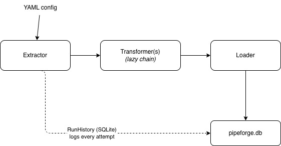

# pipeforge

A lightweight, modular ETL pipeline runner. Pipelines are defined as YAML config, executed with retry logic, and every run is logged to a local SQLite history store.

---

### Data flow



Records flow as a **lazy generator chain** — one record at a time, never fully loaded into memory. A 10 GB CSV and a 100-row CSV use the same amount of RAM.

---

## Quickstart

```bash
# 1. Clone and enter
git clone https://github.com/darenn1/pipeforge.git
cd pipeforge

# 2. Install dependencies
pip install -r requirements.txt

# 3. Run the example pipeline
python cli.py run pipelines/example.yaml

# 4. Check the run history
python cli.py history

#5 show this help message and exit
python cli.py --help
```

---

## Troubleshooting

**SSL: CERTIFICATE_VERIFY_FAILED on macOS**

Python 3.x on macOS doesn't install SSL certificates automatically. Run this once:
```bash
open "/Applications/Python 3.11/Install Certificates.command"
```

Or if that file isn't there:
```bash
pip3 install certifi
```

This is a one-time Mac system fix, not a pipeforge dependency.
